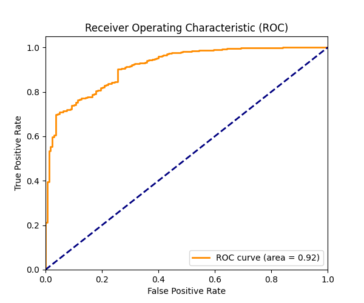
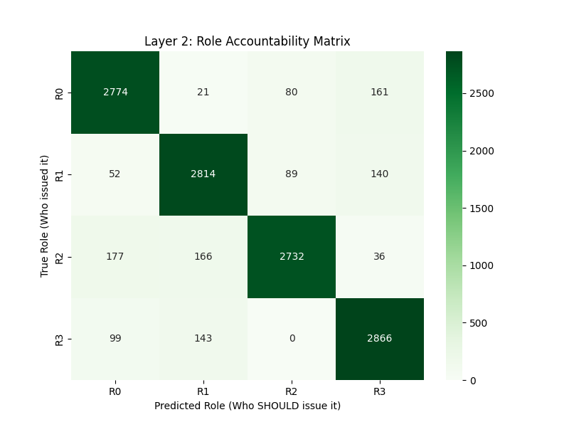
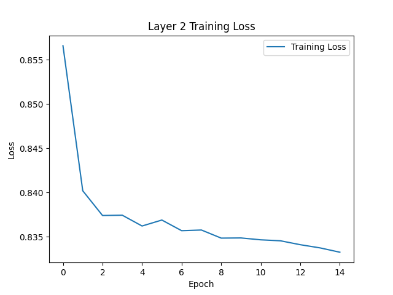
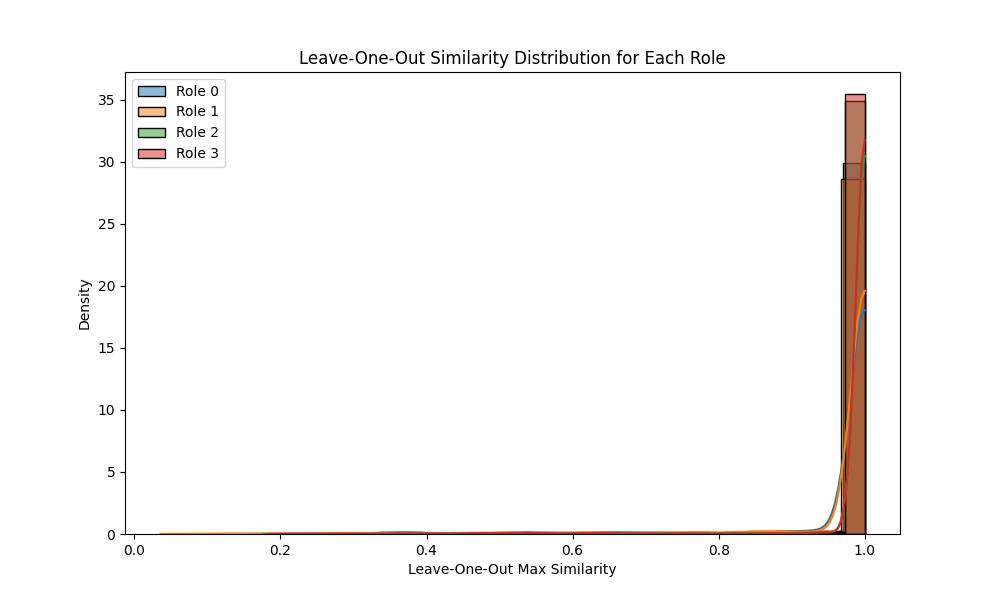
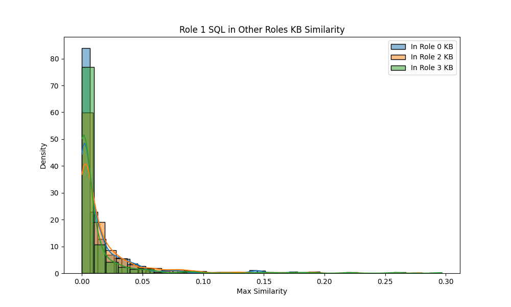
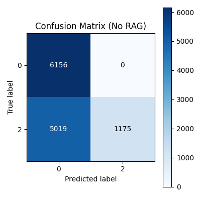

# 数据库缺陷检测模型
## 1. 引言
 本记录是记录我完成毕业设计“数据库缺陷检测模型”的全过程。本文档将详细描述项目的背景、目标、方法、实验结果以及结论。

## 2.实验环境配置
### 2.1 本机环境

第一步在本机上配置环境，安装CUDA、cuDNN和pytorch等深度学习框架。测试小数据量的运行情况，确保模型基本能够运行。

目前使用的环境如下：

CUDA 13.1

cuDNN 9.11

pytorch 2.10.0

安装教程：https://zhuanlan.zhihu.com/p/24884367657
https://blog.csdn.net/weixin_52677672/article/details/135853106
https://zhuanlan.zhihu.com/p/27577871722

## 2. 实验记录

### 2.1 数据源
 
第一层模型用SQL injection数据集，数据集来源于 https://www.kaggle.com/datasets/syedsaqlainhussain/sql-injection-dataset/data 。 

生成了一个数据集，在kaggle那个经典的sql injection数据集的基础上面，增加了角色标签，数据集生成脚本在data_generation文件夹下面，生成的数据集在data/custom文件夹下面)

解释一下角色标签的含义：表示的是当前SQL语句是哪个角色发出的，也就是说如果这个SQL语句Label为0，那么该SQL语句是该角色正常发出的，如果这个SQL语句Label为1，那么该SQL语句是该角色发出的攻击语句，如果这个SQL语句Label为2，那么该SQL语句是该角色发出的伪装攻击语句。

数据集的生成逻辑是这样的：在**经典数据集sqli**的基础上进行改动，首先标签改成**三项**，分别是**query**、**role**、**label**。其中query是sql语句，role是角色标签，label是正常和攻击的标签。

我规定了用户的表级限制，列级限制，还有用户经常做的一些操作，基于这些规则生成了正常的SQL查询语句

角色标签和其对应能够查询的表如下：

|编号|角色|可查询的表|
|:------:|:------:|:------------:|
|0|财务|'finance', 'salary', 'budget', 'revenue'|
|1|人事|'employee', 'staff', 'hr', 'attendance'|
|2|销售|'customer', 'orders', 'sales', 'leads'|
|3|开发|'logs', 'config', 'dev', 'test_table'|

每个角色只能查询自己权限内的表，查询其他角色权限内的表就算违规。

而且每个表也有可以查询的正常列和不能查询的敏感列，查询敏感列也算违规。

对应如下：

|表名|正常列|敏感列|
|:------:|:------:|:------------:|
|finance| 'record_id', 'trans_date', 'amount', 'dept_id', 'project_code', 'category'| 'admin_signature', 'hidden_assets', 'audit_trace_log' |
|salary| 'emp_id', 'basic_salary', 'bonus', 'tax_deduction', 'net_pay', 'pay_date' | 'personal_bank_card_no', 'id_card', 'family_info'|
|budget|'year', 'quarter', 'dept_name', 'approved_amt', 'remain_amt', 'status'|'manager_approval_key', 'secret_reserve_fund'|
|revenue|'source', 'channel', 'gross_income', 'net_income', 'currency', 'region'|'partner_commission_rate', 'encrypted_token'|
|employee|'emp_name', 'emp_id', 'gender', 'position', 'department', 'entry_date', 'email'|'password_hash', 'social_security_number', 'political_status'|
|staff|'staff_code', 'work_loc', 'office_phone', 'direct_manager', 'job_level', 'emergency_contact_mobile'|'home_address'|
|hr|'policy_id', 'doc_name', 'publish_date', 'interview_score', 'resume_path'|'background_check_result'|
|attendance| 'check_in', 'check_out', 'date', 'leave_type', 'overtime_hours'|'biometric_data'|
|customer|'cust_name', 'cust_level', 'last_purchase', 'points', 'public_phone'|'cust_id_card', 'home_address', 'credit_card'|
|orders|'order_id', 'prod_name', 'qty', 'total_price', 'status', 'ship_date'|'payment_gateway_token', 'fraud_check_score'|
|sales|'rep_id', 'monthly_target', 'achieved', 'region_code'|无|
|leads|'company', 'contact', 'industry', 'intent', 'source_web'|'private_mobile', 'ceo_email'|
|logs|'trace_id', 'level', 'msg', 'timestamp', 'service', 'ip_addr'|'user_session_token', 'cookie_content'|
|config|'key', 'value', 'env', 'is_active', 'version'|'db_password', 'secret_key', 'aws_access_key'|
|dev|'feature', 'test_uid', 'deploy_id', 'branch'|'prod_admin_credential'|
|test_table|'id', 'field1', 'field2', 'desc'|无|

我规定了正常操作的三种类型：
1. 访问允许的表
2. 只查询 'normal' 列 (禁止 * 查询)
3. 动词限制：
   - HR (1): SELECT, INSERT, UPDATE, DELETE
   - 其他 (0,2,3): SELECT, INSERT, UPDATE (严禁 DELETE)
   - 所有人: 严禁 DROP

具体这些表的列名和角色权限可以在tests/generate_data.py中查看

依靠这些规则，我生成了一个包含92000多条SQL语句的数据集，存储在data/custom/custom_dataset.csv中

### 2.2 模型搭建情况

**第一次汇报**：

对SQL语句特征的提取，把SQL语句输入到预训练的DistilBERT模型中，提取出768维的语义向量作为特征输入到第一层模型中去。

已经完成第一层模型的搭建，在feature.py文件上面用DistilBERT模型，利用LLM的语言理解能力，将特征提取后输入孤立森林，目前的训练方法是半监督学习，仅抽取数据集中标签为正常的样本进行训练。

已经完成第二层模型的搭建，让MLP模型分类生成每个角色的概率值，取最高那个概率值与标签对比，如果角色对应上了那就通过，没对应上就是有问题。

**第二次汇报**：

本周完成预处理对SQL语句的AST展平，提取更多结构化特征，做了几个对比实验（内容值替换，AST展平，内容值替换+AST展平）。

本周完成第一层模型和第二层模型的联合，发现效果并不好，准确率只有0.63（具体结果在实验结果）

分析了数据集后发现，第二层模型现在只实现了角色的匹配，但是我发现即使SQL语句的角色匹配上了，还是有可能是深度的伪装攻击（比如财务可以正常查询finance表，但是财务如果drop table finance就是伪装攻击了），于是我做了一个简单的改进，我在第二层模型的输入层，判断该SQL语句是否包含DROP，TURNCATE等危险操作，如果包含了就直接标记为伪装攻击（Label 2），不输入到MLP模型中去，这样就能提高第二层模型的准确率了。

简单地静态判断SQL语句是否含有DROP、DELETE等危险操作，虽然能提高第二层模型的准确率，但也过于死板了。有些角色是可以写DELETE语句，有些角色是不允许的，所以我想把RAG技术引入到第二层模型中去，让第二层模型判断该SQL操作是否符合该角色曾经有过的行为模式，而不是简单地判断是否含有某些关键词。

于是设计了一个RAG强化的方案：
1. FAISS知识库构建向量库存储：将每个角色（Role 0-3）在训练集中的正常（Label 0）SQL 操作进行向量化存储。元数据关联：每个向量都要挂载该 SQL 的关键属性（如：操作类型、目标表名、目标列名）。
2. BERT+MLP 概率预测这部分保持原来的思路：BERT提取语义，MLP输出4个角色的概率分布。
3. 核心改进：
- 如果当前SQL是 DELETE，检索结果显示该角色过去从未进行过写操作，或者检索到的相似操作中完全没有该目标表，那就说明该SQL语句极有可能是伪装攻击，需要报告给MLP。将“检索到的相似度得分”作为一个额外的特征输入给 MLP。如果最高相似度极低，说明该角色从未有过类似行为，直接判定为伪装攻击（Label 2）。
- 预测概率与Role标签的对齐的目标是预测角色并与真实Role匹配。判定标准：只有当 角色匹配 且 RAG 相似度 > 阈值 时，才标记为正常（Label 0）。
- 使用L2距离作为相似度度量（越相似的SQL向量L2距离越低），设定一个阈值（此处设置0.7），如果相似度得分高于该阈值，就认为该SQL语句与该角色的历史行为模式不符，可能是伪装攻击。

对于RAG技术是否能用于该数据集，我检查了同一个角色在知识库里的SQL语句相似度，并且检查了一个角色在其他角色的SQL语句相似度，发现同一个角色的SQL语句相似度普遍较高，而不同角色的SQL语句相似度普遍较低，因此RAG技术是适用于该数据集的。

经过RAG技术的强化，第二层的准确率已经达到了0.97了，具体数据在下一部分展示。

### 2.3 实验数据

**第一次汇报**：

所有实验结果全部存放在notebooks文件夹下面，命名方式为"exp_模型关键参数_时间戳",

1.第一层模型实验结果（(20260128_2027)

特征提取：
HuggingFace的transformers库，加载distilbert-base-uncased预训练模型，调用AutoTokenizer和AutoModel进行文本编码，将SQL语句转换为768维的语义向量。

model_name: "distilbert-base-uncased"
- max_length: 128
- batch_size: 32

第一层模型：
使用随机森林进行SQL注入检测。

model_name: "isolation forest"
- n_estimators: 200 （树的数量，越多越稳定）
- contamination: 0.5 （异常样本比例）
- max_samples: "auto" （每棵树的样本数）
- random_state: 42 （随机种子，确保结果可复现）
- n_jobs: -1 （使用所有CPU核心进行并行计算）
- max_features: 1.0 (每棵树使用的特征，1.0表示使用所有特征)
- bootstrap: False (是否有放回采样)

目前第一层模型在测试集(我自己生成的那个）上的效果如下(最好一次)：
```chatinput
              precision    recall  f1-score   support

      Normal       0.87      0.95      0.91     12295
      Attack       0.88      0.71      0.78      6229

    accuracy                           0.87     18524
   macro avg       0.87      0.83      0.85     18524
weighted avg       0.87      0.87      0.87     18524
```
还有roc图片如下:


2.第二层模型实验结果(20260129_1102)

第二层模型：

用整数（0,1,2,3）表示角色类别，将BERT模型生成的高维语义向量直接输入多层感知机（MLP），输出4类角色的概率分布。

model_name: "MLP"
- hidden_layer1: 512单元，BatchNorm,ReLU,Dropout(0.3)
- hidden_layer2: 128单元，BatchNorm,ReLU,Dropout(0.3)
- output_layer: 4单元，Softmax激活函数
- 损失函数：CrossEntropyLoss
- 优化器:Adam,学习率:0.001
- 训练轮数：15

目前第二层模型的实验结果如下(最好一次)（这是MLP模型判断SQL语句属于那个角色的准确率）：
```chatinput
              precision    recall  f1-score   support

          R0       0.89      0.91      0.90      3036
          R1       0.90      0.91      0.90      3095
          R2       0.94      0.88      0.91      3111
          R3       0.89      0.92      0.91      3108

    accuracy                           0.91     12350
   macro avg       0.91      0.91      0.91     12350
weighted avg       0.91      0.91      0.91     12350
```
混淆矩阵：


Loss曲线变化:



**第二次汇报**：

最终整体框架：

把两层模型整合在一起，先给数据集划分成80%的训练集和20%的测试集，模型训练方法和之前一样。第一层模型筛选出来的异常SQL语句标记为1后就抛弃不输入到第二层模型中去，然后第二层模型判断为异常的SQL语句标记为2，最后判断标记为0的数量和Label为0的SQL语句进行对比，得到准确率。
```chatinput
              precision    recall  f1-score   support

          正常       0.54      0.95      0.69      6227
          注入       0.88      0.74      0.80      6161
          伪装       0.50      0.19      0.27      6136

    accuracy                           0.63     18524
   macro avg       0.64      0.63      0.59     18524
weighted avg       0.64      0.63      0.59     18524
```

观察该表格发现正常和伪装项的准确率低，但是注入攻击的准确率高，问题可以定位到第二层模型上。

在第二层模型详细的实验结果里面，看出来模型把很多伪装攻击（2）的SQL语句判定为正常（0），但是角色匹配又是正确的，数据集里一些SQL语句的确是该角色发出的，但是该SQL语句的内容和该角色收到的一些操作限制相违背，模型没有对此做判断，因此判断失误。于是我对模型进行了改进，详细的改进策略在模型搭建情况处已经描述。

首先我对该数据集进行了分析，统计了每个角色的SQL语句的相似度，发现同一个角色的SQL语句相似度普遍较高，而不同角色的SQL语句相似度普遍较低，因此RAG技术是适用于该数据集的。

同一角色的SQL语句相似度：



从图中可以看出，四个角色每一个角色的SQL语句相似度都比较高，说明同一个角色的SQL语句在语义上是比较相似的。

不同角色的SQL语句相似度：





从图片中看出，不同角色的SQL语句相似度普遍较低（低于0.05），说明不同角色的SQL语句在语义上是比较不相似的。

这是没有引入RAG技术的第二层模型的实验结果：



从混淆矩阵可以看出，伪装攻击（2）被大量误判为正常（0）。说明模型预测时标准太松，角色匹配后就没有继续判断SQL语句的合理性。

加入静态的关键词检测（DROP，DELETE等）后，第二层模型的实验结果：


从图中可以看出比起没有规则检测的混淆矩阵，伪装攻击（2）被误判为正常（0）的数量减少了很多，说明静态规则检测确实提升了模型的准确率。

加入RAG技术后的第二层模型的实验结果：


详细的数据：
```chatinput
ID    | True_Role  | Pred_Role  | Result   | Confidence | RAG_Sim  | SQL_Snippet                                             | pred  | actual
----------------------------------------------------------------------------------------------------------------------------------------------------------------
0     | 3          | 3          | MATCH    | 1.0000     | 5.8203   | SELECT * FROM dev WHERE id > 100...                     | 2     | 2     
1     | 3          | 3          | MATCH    | 1.0000     | 0.0000   | UPDATE logs SET timestamp='new' WHERE timestamp=1...    | 0     | 0     
2     | 1          | 1          | MATCH    | 1.0000     | 0.0000   | SELECT count(entry_date) FROM employee...               | 0     | 0     
3     | 2          | 2          | MATCH    | 1.0000     | 0.0000   | SELECT region_code, monthly_target FROM sales WHER...   | 0     | 0     
4     | 1          | 1          | MATCH    | 1.0000     | 6.4319   | SELECT * FROM employee...                               | 2     | 2     
5     | 1          | 1          | MATCH    | 1.0000     | 0.0000   | UPDATE staff SET work_loc='new' WHERE work_loc=1...     | 0     | 0     
6     | 3          | 3          | MATCH    | 1.0000     | 4.0554   | SELECT count(cookie_content) FROM logs...               | 2     | 2     
7     | 2          | 2          | MATCH    | 1.0000     | 0.0000   | SELECT last_purchase FROM customer WHERE last_purc...   | 0     | 0     
8     | 3          | 1          | MISMATCH | 0.4875     | 5.5550   | SELECT dept_id FROM finance LIMIT 1...                  | 2     | 2     
9     | 0          | 0          | MATCH    | 1.0000     | 5.4229   | SELECT * FROM finance...                                | 2     | 2     
10    | 1          | 1          | MATCH    | 1.0000     | 5.9306   | SELECT background_check_result, id FROM hr WHERE i...   | 2     | 2     
```

从表格中看出，加入RAG技术后，第二层模型能通过计算RAG_Sim这个特征来判断该SQL语句是否符合该角色的历史行为模式，RAG_Sim越大，说明越偏离历史的行为特征，判断为伪装攻击，从而提升了模型的准确率。

最后，把训练好的第二层模型与第一层模型一起部署在测试集上进行测试，最终的整体框架的实验结果如下：

```chatinput
              precision    recall  f1-score   support

          正常       1.00      0.93      0.96      6227
          注入       0.88      0.74      0.80      6161
          伪装       0.77      0.95      0.85      6136

    accuracy                           0.87     18524
   macro avg       0.88      0.87      0.87     18524
weighted avg       0.89      0.87      0.87     18524
```

准确率从之前的0.63提升到了0.87，说明RAG技术的引入确实提升了模型的准确率。

## 3. 后续工作计划
数据集优化：尝试优化自己生成的数据集，加入更多细节和样本量，使其更加真实

数据处理优化：1.尝试使用AST对SQL语句展平，提取更多结构化特征 2.尝试使用其他的预训练模型进行特征提取。

第一层模型的优化：1.尝试调整孤立森林的参数，提高准确率。 2.查找其他的集成异常检测器进行对比实验。

第二层模型的优化: 1.加入RAG技术，增强大语言模型对上下文的理解能力。 2.尝试用其他的大语言模型进行对比实验。

将第一层模型和第二层模型进行联合训练，提升整体的检测效果

## 参考文献

[1] 罗艺铭，谭玉波，李建平．基于BERT-GAN的SQL注入攻击检测方法研究[J]. 微电子学与计算机，2024，41（11）：39-47. DOI:  10.19304/J.ISSN1000-7180.2023.0721（这个文章讲的是对抗网络取检测SQL注入攻击，可以试试用在第一层模型上面）
https://mc.spacejournal.cn/article/doi/10.19304/J.ISSN1000-7180.2023.0721


[2] 张昊,张小雨,张振友,等.基于深度学习的入侵检测模型综述[J].计算机工程与应用,2022,58(06):17-28.（这个文章是一篇类似综述的，把别人做过的深度学习做入侵检测的整合了）（知网搜）

[3] Enhancing GraphQL Security by Detecting Malicious Queries Using Large Language Models, Sentence Transformers, and Convolutional Neural Networks(利用大型语言模型、句子转换器和卷积神经网络检测恶意查询，增强GraphQL安全性，虽然不是SQL，但是也有参考意义)
https://arxiv.org/abs/2508.11711

[4] 胡修闻.基于AST-LSTM和对抗训练的混淆SQL注入攻击检测研究[D].东南大学,2024.DOI:10.27014/d.cnki.gdnau.2024.004766.（这篇文章用LSTM做了个类似上下文增强的，第二层模型可以试试，不用RAG）（知网搜）
